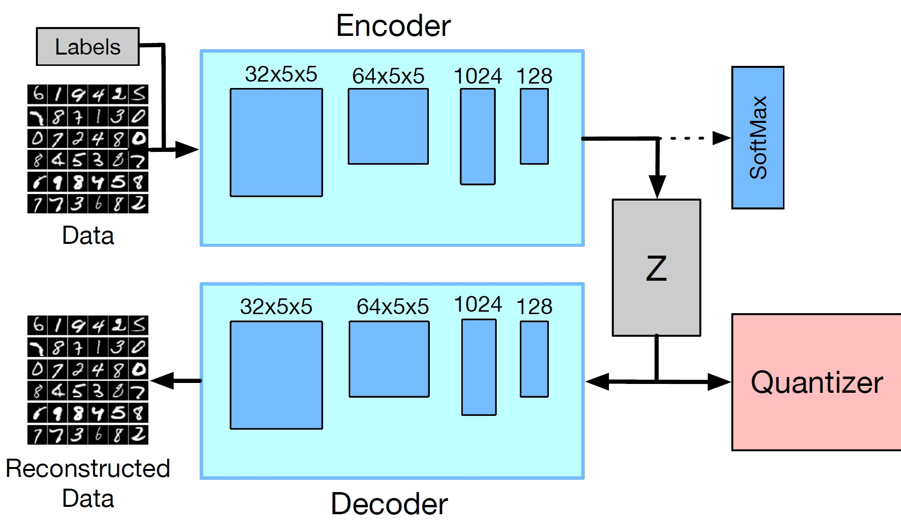
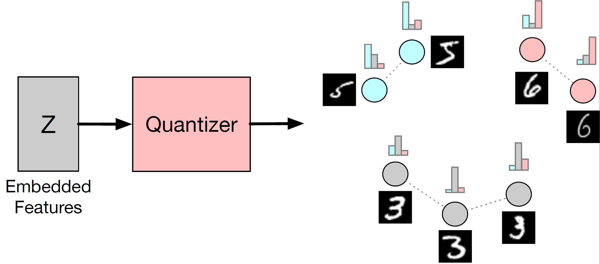
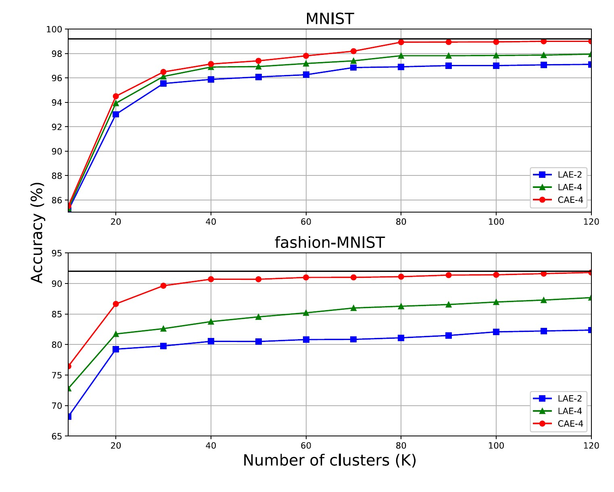
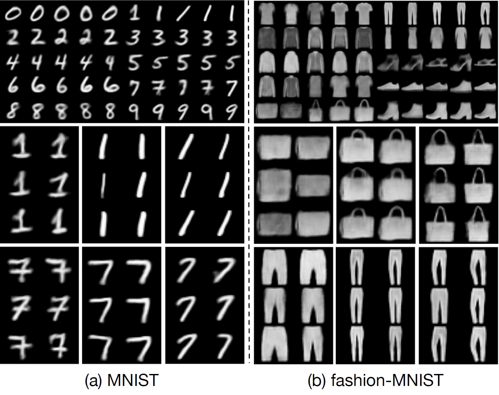
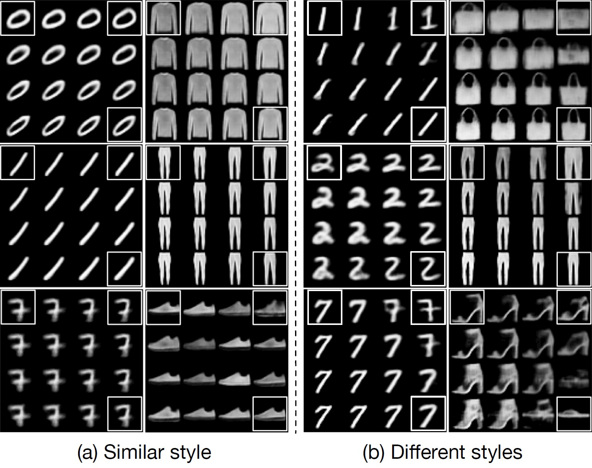

# SUPERVISED ENCODING FOR DISCRETE REPRESENTATION LEARNING

This is the source code for Supervised Encoding for Discrete Representation Learning paper (https://arxiv.org/pdf/1910.11067.pdf).


## Description

Classical supervised classification tasks search for a nonlinear mapping that maps each encoded feature directly to a probability mass over the labels. Such a learning framework typically lacks the intuition that encoded features from the same class tend to be similar and thus has little interpretability for the learned features. In this paper, we propose a novel supervised learning model named Supervised-Encoding Quantizer (SEQ). The SEQ applies a quantizer to cluster and classify the encoded features. We found that the quantizer provides an interpretable graph where each cluster in the graph represents a class of data samples that have a particular style. We also trained a decoder that can decode convex combinations of the encoded features from similar and different clusters and provide guidance on style transfer between sub-classes.

The illustration of the supervised-encoding quantizer (SEQ) and the quantization process:
<p align="center">
  
  <br>
</p>

The illustration of the quantization process:
<p align="center">
  
</p>

## Getting Started

### Dependencies

* Requires Pytorch, Numpy
* MNIST dataset (https://www.kaggle.com/oddrationale/mnist-in-csv)
* fashion-MNIST dataset (https://www.kaggle.com/zalando-research/fashionmnist)

### Executing program

* First, train the encoder of the autoencoder. The hidden features are clustered by k-means quantizer algorithm.
```
python main_encoder.py
```
* Next, train the decoder of the autoencoder. Generate new data using the decoder with the convex hull combination features.
```
python main_decoder_mnist.py
```
Similarly, for fashion-MNIST, run the following:
```
python main_decoder_fmnist.py
```

### Results
The graphs below indicate the performance of the SEQ over the number of pre-determined clusters in k-means. As the number of clusters increases, the performance of the SEQ increases. 
<p align="center">
  
</p>

Next, we use the decoder to decoder the hidden features of the same clusters. As shown in figure below, the images are divided into sub-classes. For example, there are multiple style for digit 0. It indicates the meaningful of the hidden features that being clustered.
<p align="center">
  
</p>

Lastly, we generate new hidden feature by convex hull combination of the data from different sub-classes. As the result, we generate novel images by passing the generated hidden features through the decoder of the autoencoder.
<p align="center">
  
</p>

## Authors

Cat P. Le (cat.le@duke.edu), 
<br>Yi Zhou, 
<br>Jie Ding, 
<br>Vahid Tarokh